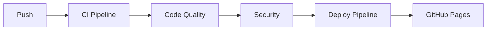
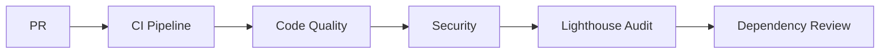

# 🚀 CI/CD Pipelines

Este projeto utiliza GitHub Actions para automação de CI/CD, garantindo qualidade de código e deployment automático.

## 📋 Pipelines Disponíveis

### 1. **CI Pipeline** (`ci.yml`)
Executa em push/PR para `master`, `main` e `develop`.

**Jobs:**
- ✅ **Test & Lint**: Executa testes e verificações de código em Node 18.x e 20.x
  - Biome lint
  - Biome format check
  - Testes com cobertura
  - Upload para Codecov

- 🏗️ **Build**: Compila o projeto
  - Gera artifacts de build
  - Valida se o projeto compila sem erros

- 🔍 **Lighthouse Audit**: Análise de performance (apenas em PRs)
  - Testa métricas de performance
  - Acessibilidade
  - SEO
  - Best practices

### 2. **Deploy Pipeline** (`deploy.yml`)
Executa em push para `master`/`main` e pode ser acionada manualmente.

**Jobs:**
- 🏗️ **Build**: Compila o projeto para produção
  - Executa Biome check
  - Build otimizado sem sourcemaps

- 🚀 **Deploy**: Publica no GitHub Pages
  - Deploy automático
  - URL disponível nos environments
  - Summary com informações do deployment

### 3. **Code Quality Pipeline** (`code-quality.yml`)
Executa em push/PR para branches principais.

**Jobs:**
- 🔧 **Biome Check**: Verificações de qualidade
  - Lint com reporter do GitHub
  - Format check
  - Full check com auto-fix

- 📦 **Bundle Size Check**: Análise de tamanho do bundle
  - Tamanho dos arquivos JS
  - Tamanho total do build
  - Summary com estatísticas

- 🔍 **Dependency Review**: Revisão de dependências (apenas PRs)
  - Identifica vulnerabilidades
  - Falha em severidade moderada ou maior

### 4. **Security Pipeline** (`security.yml`)
Executa em push/PR e semanalmente (segundas às 9h UTC).

**Jobs:**
- 🔒 **npm Audit**: Auditoria de dependências
  - Identifica vulnerabilidades
  - Sugere correções

- 🛡️ **CodeQL Analysis**: Análise de código estático
  - Detecta vulnerabilidades de segurança
  - Padrões de código inseguro

- 🐍 **Snyk Security Scan**: Scan de segurança (opcional)
  - Requer `SNYK_TOKEN` secret
  - Detecta vulnerabilidades conhecidas

### 5. **Dependabot** (`dependabot.yml`)
Atualização automática de dependências toda segunda-feira às 9h UTC.

**Configurações:**
- 📦 npm: Máximo 10 PRs abertos
- 🔄 GitHub Actions: Máximo 5 PRs abertos
- Ignora major updates de React/React-DOM/React-Scripts
- Auto-assign para `brenoASantana`
- Labels automáticos

### 6. **Stale Bot** (`stale.yml`)
Gerenciamento de issues e PRs inativos.

**Configurações:**
- Issues: Marcadas como stale após 60 dias, fechadas após 7 dias
- PRs: Marcadas como stale após 30 dias, fechadas após 7 dias
- Mensagens em PT-BR e EN-US

## 🎯 Fluxo de Trabalho

### Push para `master`/`main`:


### Pull Request:


## 🔧 Configuração Necessária

### Secrets (Opcionais):
- `SNYK_TOKEN`: Token do Snyk para security scan

### Permissions:
As pipelines já estão configuradas com as permissões necessárias:
- `contents: read/write`
- `pages: write`
- `id-token: write`
- `security-events: write`

### GitHub Pages:
1. Vá em Settings → Pages
2. Source: GitHub Actions
3. A URL será: `https://brenoASantana.github.io/portfolio`

## 📊 Badges

Adicione ao README.md:

```markdown


```

## 🚨 Troubleshooting

### Erro: "Resource not accessible by integration"
- Verifique se as permissões do workflow estão corretas
- Em Settings → Actions → General → Workflow permissions: escolha "Read and write permissions"

### Erro de build
- Verifique se `npm ci --legacy-peer-deps` funciona localmente
- Verifique se há erros de lint/format

### Deploy não funciona
- Confirme que GitHub Pages está configurado para usar GitHub Actions
- Verifique se o `homepage` no package.json está correto

## 📝 Manutenção

### Atualizar versão do Node:
Edite a matriz `node-version` em `ci.yml`:
```yaml
strategy:
  matrix:
    node-version: [18.x, 20.x, 22.x]
```

### Desabilitar pipeline:
Comente a seção `on:` ou delete o arquivo `.yml`.

### Adicionar novos checks:
Crie um novo job no arquivo apropriado seguindo o padrão existente.

## 🎓 Aprendizado

Este setup de CI/CD demonstra:
- ✅ Testes automatizados
- ✅ Verificações de qualidade de código
- ✅ Segurança de dependências
- ✅ Deploy automático
- ✅ Análise de performance
- ✅ Gerenciamento de dependências

Ideal para mostrar em entrevistas e discussões técnicas sobre DevOps e boas práticas de desenvolvimento.
